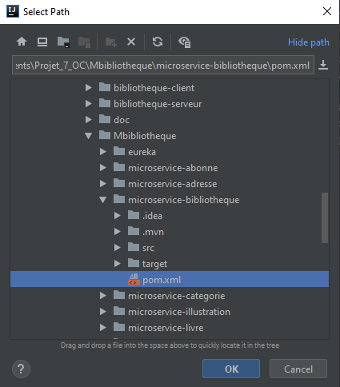
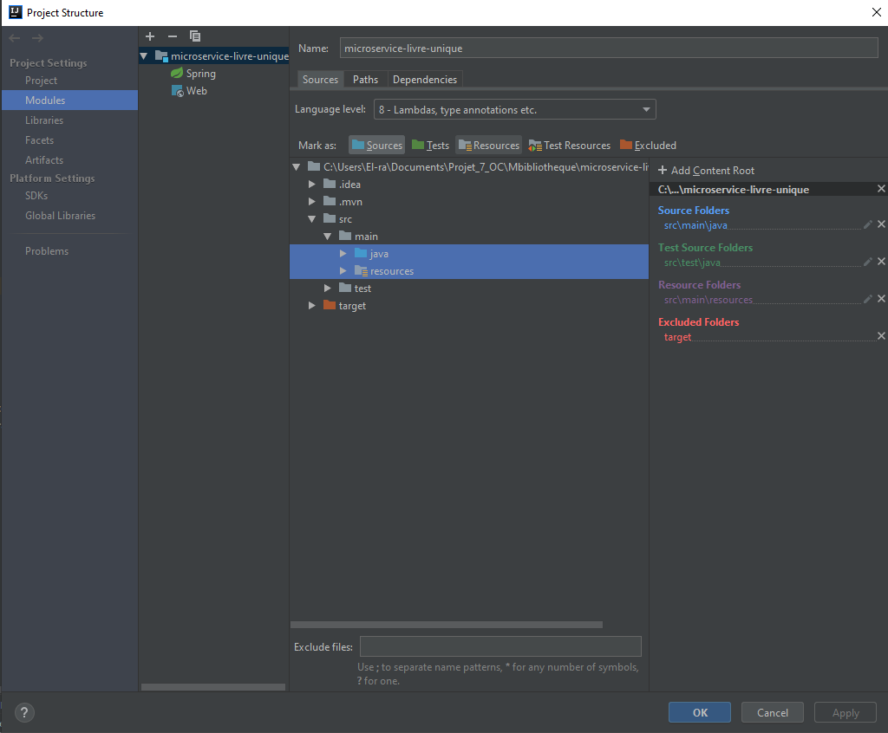
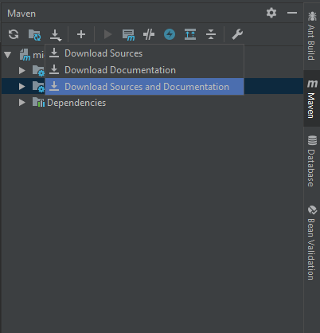
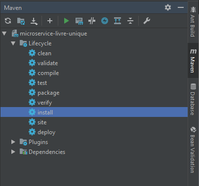

##  Mettre en place l'application
   
####  1) Créer la base de données :

   1. Faire un backup de la base de données avec le fichier SQL/backup.
    
   #   Mettre en place bibliotheque-seveur :
    
####   Modifier les variables dans le fichier webapp/META-INF/context.xml :

   1. Mettre l'url de la base de données.
   2. Changer l'username.
   3. Changer le password.
    
####   Modifier les variables dans le fichier batch/src/data/conf/db-ticket.properties :
    
   1. Mettre l'url de la base de données.
   2. Changer l'username.
   3. Changer le password.

#   Mettre en place les microservices :

  #####Ouvrir le dossier MBibliotheque via son IDE
  
  ##  Mettre en place eureka avant les microservices, celui-ci s'implèmente de la même façon que les microservices.
    
   ####Action demandé pour chaque microservice : 
   
   Via Maven sélectionner le pom.xml du microservice via "Add Maven project" 
   
   
   
    
    Dans le Project Structure / Modules
        définir dans src/main le dossier java comme Source
        et le resources comme Resources
 
   
   
   
   Via Maven effectuer un download des sources pour vérifier que vous possèdez bien toutes les dépendances.
   
   
   
   Via Maven faire un install du microservice
   
   
   
   
   Pour faire fonctionner les microservices, vous devez lancer eureka dans un premier temps.
   
   
   # Mettre en place bibliotheque-client
   
   1. Effectuer les mêmes actions que pour un microservice.
   2. Chaques microservices doit-être lancé pour pouvoir lancer le client.
   
   Mot de passe du certificat de SSL : Yocorps17